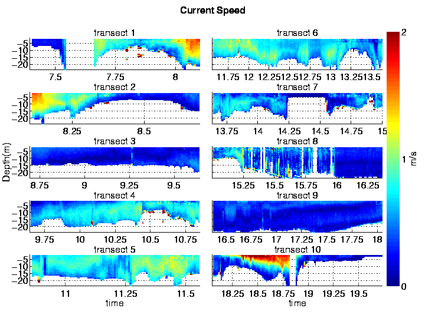

In the incubator today I spent some time helping Allison Smith get set up with github, but the conversation quickly turned to processing ADCP data.  ADCP stands for Acoustic Doppler Current Profiler.  I actually have a fair amount of experience working with ADCP data due to my previous life at the Center for Coastal Margin Observation and Prediction (CMOP). An ADCP is an oceanographic instrument that uses three or four membranes to create sound waves underwater.  These sound waves bounce off particles (and thermoclines, and everything else) in the water and are received back by the instrument.  By triangulating from the different membranes and measuring the return time, you can deduce how fast the water is moving and in what direction.  Better yet, you get an entire profile of velocities at once.  So you can mount it on the bottom of a river pointing up and get a timeseries of the water column.  Or you can mount it on a ship pointing down and get a transect, like this:

The trouble is that the ship rocks back and forth, makes a lot of noise, and makes a lot of bubbles, which confounds the data processing for an already sensitive instrument and difficult calculation. 

Enter UHDAS (the University of Hawaii Data Acquisition System) and CODAS (the Common Ocean Data Access System).  These two systems perform the data processing and organize the data or analysis.  There is a boatload (ahem) of smarts in these systems, but they suffer fro mthe same drawback as any other complex data management system: the ramp-up costs in getting the software installed, the data loaded, and a client working.

Allison is working with one of these CODAS "databases." (As a database snob, I give myself permission to airquote the word database when we're actually talking about a collection of files + an API --- what Jim Gray used to call a "nascent database.")  CODAS is a set of file formats and libraries for organizing ADCP data.  There's a python interface, and as I spoke with Allison, I started to remember that I had written some software to work with CODAS databases back in 2006.  We had a library for extracting data from all the sensors on the vessel, integrate them, and put them in a proper database.  We used gamin the File Alteration Monitor to watch the directories in which the various sensors deposited files (or appended to existing files), then triggered routines to extract the newly deposited data, organize it, and insert it into the database. The nice thing about this design was that there was no need to poll for changes or figure out what had changed --- the operating system told us exactly what had changed, whenever anything had happened.  The trick is you have to install a kernel module to make it work, but that was not a big deal.

All of this work was part of our "Ocean Appliance": A complete chassis computer loaded with data acquisition, integration, and analysis software, along with a web interface for serving it out to the ship's network and the broader Internet (when a connection was present.)  We [wrote a little paper about it](http://citeseerx.ist.psu.edu/viewdoc/summary?doi=10.1.1.165.9045).

But Allison didn't need on-vessel event processing -- she just needed the data in a format she could use!  So we postponed installing python, CODAS, etc., and asked Jules Hummon at UoH to see if she could just extract some nice NetCDF files.
